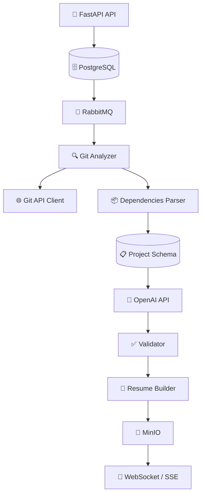

<div align="center">

# 🚀 AI Resume Builder from Git

**Автоматическая генерация IT-резюме на основе анализа Git-репозиториев**

[](https://fastapi.tiangolo.com/)
[](https://www.rabbitmq.com/)
[](https://openai.com/)
[](https://min.io/)

</div>

---

## 📖 О проекте

Сервис анализирует **публичные Git-репозитории** (GitHub, GitLab, GitFlic) и на основе:

* кода
* структуры проекта
* README

генерирует персонализированное резюме разработчика в формате:

👉 `.pdf` / `.docx` с помощью **OpenAI**

> 🎯 Превращает «цифровой след» разработчика в готовое профессиональное резюме за считанные минуты

---

## 🧠 Архитектура системы



---

## ⚙️ Pipeline обработки

### 1️⃣ Прием задачи

* FastAPI принимает `user_id` и `git_url`
* создаётся уникальный `task_id`
* задача отправляется в очередь (**RabbitMQ**)

---

### 2️⃣ Анализ репозитория

| Источник                | Что извлекается                                  |
| ----------------------- | ------------------------------------------------ |
| 📄 README               | цели проекта, архитектура, примеры использования |
| 📝 Description / Topics | краткое описание проекта                         |
| 🗂 Структура            | организация кода (src, mvc, cli и т.д.)          |
| 🌍 Languages            | стек технологий                                  |
| 📦 Dependencies         | библиотеки и фреймворки                          |

---

### 3️⃣ Формирование модели

```python
class ProjectInformationSchema:
    general: GeneralInfoSchema      # readme, description, topics
    stack_info: StackInfo           # languages, dependencies
    structure: list[str]            # структура проекта
```

---

### 4️⃣ AI-генерация

* формируется оптимизированный prompt
* отправка в OpenAI API
* результат → **Markdown-резюме**

---

### 5️⃣ Постобработка

| Компонент              | Назначение                                      |
| ---------------------- | ----------------------------------------------- |
| ✅ ResumeValidator      | проверка корректности и устранение галлюцинаций |
| 🛠 ResumePostProcessor | приведение к структуре (Опыт, Навыки, Проекты)  |

---

### 6️⃣ Сборка и доставка

* 📄 Генерация `.pdf` / `.docx`
* 💾 Сохранение в MinIO (S3-совместимое хранилище)
* 🔗 Отправка ссылки через WebSocket / SSE

---

## 🧩 Технологии

* ⚡ FastAPI
* 🐇 RabbitMQ
* 🗄 PostgreSQL
* 🤖 OpenAI API
* 💾 MinIO

---

## ✨ Особенности

* Асинхронная архитектура
* Глубокий анализ Git-репозиториев
* Генерация резюме с помощью AI
* Поддержка нескольких Git-платформ
* Экспорт в PDF и DOCX

---

## 📌 Roadmap

* [ ] Поддержка приватных репозиториев
* [ ] Web-интерфейс
* [ ] Кастомные шаблоны резюме
* [ ] Анализ Git history (вклад разработчика)

---

## 🚀 Быстрый старт (пример)

```bash
git clone https://github.com/your-repo/ai-resume-builder.git
cd ai-resume-builder

docker-compose up --build
```

---

## 📬 API пример

```http
GET /resume?git_url=https://github.com/user/repo&user_id=123
```

---

<div align="center">

### 🔥 Сделай своё резюме из кода — автоматически

</div>
